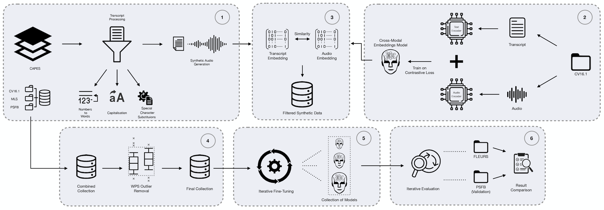

# Sematic Audio Filtering for ASR
Enhancing Automatic Speech Recognition: Effects of Semantic Audio Filtering on Models Performance

### The folders are distributed in the following order: 

Filtering Framework-> All the steps for the creation of the filtering methods of synthetic audio

tts_data_augmentation -> Serves as the folder for all the files and the scripts to create synthetically generated audio

env.example -> example of how the .env file should be structured

## The collection of Whisper Models, which have the best performance in our experiments, is available at :
Whisper-Large-v3: https://huggingface.co/my-north-ai/whisper-large-v3-pt

Whisper-Medium: https://huggingface.co/my-north-ai/whisper-medium-pt

Whisper-Small: https://huggingface.co/my-north-ai/whisper-small-pt

Paper available here : https://ieeexplore.ieee.org/document/10720758/
